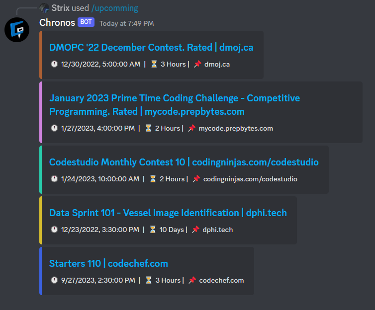

# Pixel

 

    

## Example 

 

## TODO

- ASAP: 
    - [ ] Complete embeds for upcomming (Add buttons to notify for each event & pagination at the end of the message)
    - [ ] Add command for ongoing events
    - [ ] Add command for fetching ressources
- Eventually:
    - [ ] Add Calendar links (Apple/Google/Etc.) to event commands
    - [ ] Route API calls to backend database to throttle (In case of too many users)
    - [ ] Premium option to add extra api calls
    - [ ] Marketing website
